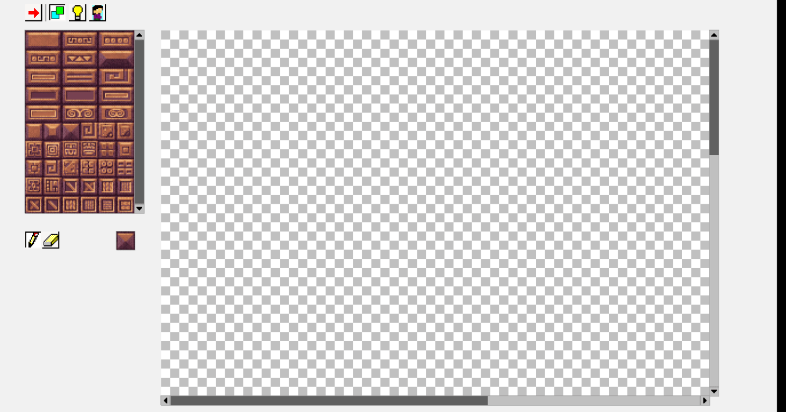

```
 _   _____ ___   ___  _     ____  
| | |_   _/ _ \ / _ \| |   / ___| 
| |   | || | | | | | | |   \___ \ 
| |___| || |_| | |_| | |___ ___) |
|_____|_| \___/ \___/|_____|____/ 
                                  

```

----
Developer Tools for Lighter game ([repo here](https://github.com/lukaszszymankiewicz/lighter))

Current work status:




This toolchain will contain:
 - [ ] level editor
 - [ ] sprite/animation/hitbox editor
 - [ ] light effect sketcher

----

The goal of this tools are to ease developing of Lighter, learn how to use Golang,
and create such a program that will allow anybody to make their own creations for the game.

All tools will work in the browser and will allow to test it out there as well.

Because one and only editor I really know is RPG Maker 2000, Ltools will propably be a huge ripoff of it.

----
